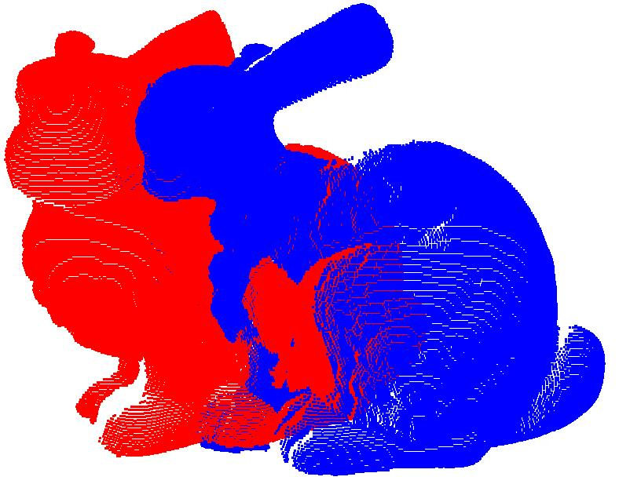
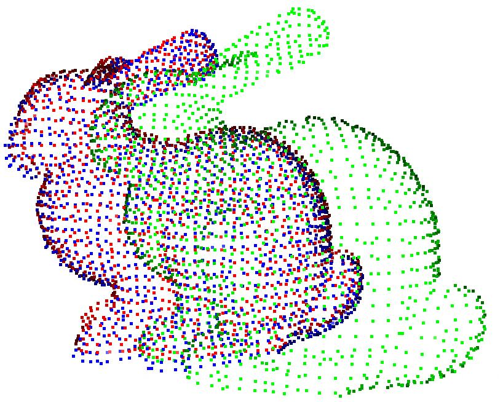
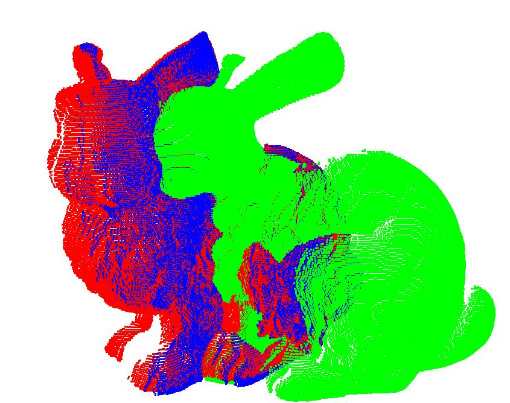

# open3d09_install
open3d 0.9.0, easy install
# note
all 3rdparty source code such as eigen, pybind11 .etc, have already downloaded and unzipped to folder "3rdparty",
you only need to download source code [here](https://github.com/Noel-Gallagher-Highflyingbirds/open3d09_install/releases/tag/v1.0.0) and use cmd following to install open3d0.9 on your machine


# windows
test on windows10 with vs2019, cmake3.22, python3.7

unzip open3d09_install.zip Manually\
activate your conda virtual environment
```bash
conda activate <your_env_name>
```

use cmd following
```bash
cd open3d09_install
mkdir build
cd build
cmake -DCMAKE_BUILD_TYPE=Release -DCMAKE_INSTALL_PREFIX="your_install_path" ..
cmake --build . --config Release --target ALL_BUILD
cmake --build . --config Release --target INSTALL
cmake --build . --config Release --target pip-package
pip install .\lib\python_package\pip_package\open3d-0.9.0.0-cp37-cp37m-win_amd64.whl
conda list
```
then you'll see open3d(python) installed in your virtual environment

# linux
test on ubuntu1604 with gcc7.5, python 3.7\
install gcc7.5 on your machine:\
[https://blog.csdn.net/liaoze22/article/details/107821653](https://blog.csdn.net/liaoze22/article/details/107821653)\
or\
[https://www.cnblogs.com/shuazi/p/10688992.html](https://www.cnblogs.com/shuazi/p/10688992.html)

cmd
```bash
unzip open3d09_install.zip  -d open3d09_install
cd open3d09_install
mkdir build
mkdir install
cd build
cmake -DCMAKE_INSTALL_PREFIX=../install -DCMAKE_BUILD_TYPE=Release ..
make -j4
make install -j4
make pip-package
```
if you install open3d before, you need to uninstall it first
```bash
pip uninstall open3d
```
then install the compile version
```bash
pip install lib/python_package/pip_package/open3d-0.9.0.0-cp37-cp37m-linux_x86_64.whl
```
note:filename "open3d-0.9.0.0-cp37-cp37m-linux_x86_64.whl" depends on your python version

# test
```bash
cd ../test
```
use open3d to show and register point cloud
```bash
python test.py
```

## result
show point cloud



register_bunny.jpg


refine_registration_bunny.jpg



# tips:
1. "your_install_path" is the path you want to install open3d binary files, for example: \
**D:/carlos/Program Files/open3d09_install/**(windows), \
**/home/carlos/open3d_install/**(linux)\
2. for DCMAKE_BUILD_TYPE, Release mode is recommended for it runs faster than Debug mode

# references
[http://www.open3d.org/docs/0.9.0/compilation.html](http://www.open3d.org/docs/0.9.0/compilation.html)\
[http://www.open3d.org/docs/release/compilation.html](http://www.open3d.org/docs/release/compilation.html)


